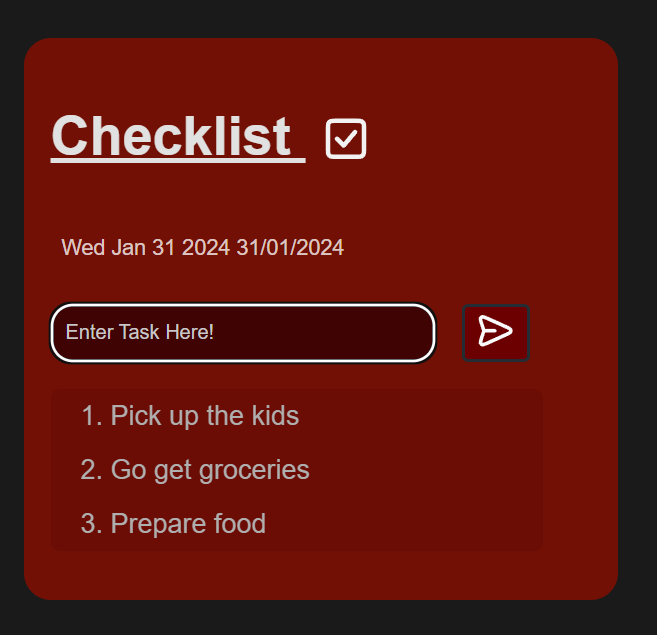
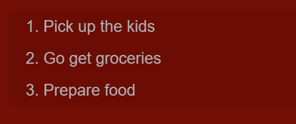
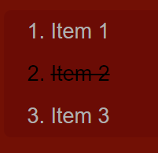
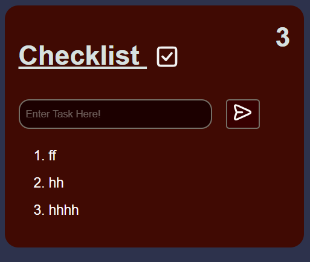

# Testing - Task Manager
---

## Contents:
  * [W3C Validator](#w3c-html-validaton)
  * [Jigsaw](#jigsaw-css-validation)
  * [Testing User Stories](#testing-user-stories)
---

## Jigsaw CSS Validation 
| Bug (class)   | Error  | Soloution & Result |
| :------------ |:---------------| :-----|
|I had four warnings for 'webkit' elements (see screenshot below)|These were not necessary elements and therefore were easily removed. This is especially true for the changes to the scrollbar, which would be unnoticeable for such an application as this.|PASS|

Normally the following 'errors' would not affect my code in any meaningful way, and by removing this code, my website would loose features. For example, code such as "-webkit-tap-highlight-color: transparent;" can have a positive effect on the webpage, such as removing the blue box when a button on a mobile is clicked, improving mobile UX. In this case however, I have removed these tools because they are not completely necessary in this particular project.

After Removal of the aforementioned items:

## W3C HTML Validation

### *index.html:*

| Error | Soloution & Result | Pass or Fail |
| :-------- | :-----|:- |
|Bad value - Empty string instead of MIME type|I removed the type proprrty|PASS|
|tag body seen but an element of the same type was already open|To fix this, I removed the second "body" element|PASS|
|Saw an end tag after body had been closed.|Removed additional body element, allowing the page to render content correctly. Resolving this issue also resolved multiple other errors in the validator|PASS|
|Attribute aria-placeholder not allowed on element div at this point|Here I removed the unused aria-element to resolve the bug|PASS|

After thorough testing, all HTML Code Valid:

## JS Lint
### *source.js:*
| Error | Soloution & Result | Pass or Fail |
| :---- | :-----|:- |
|Line is longer than 80 characters.|I solved this issue by separating  comments in my code, making my code more readable|PASS|
|Unexpected 'for' -> 'for (t in task)'|By converting from a 'for ... in' loop, to a 'for ... of'. This allows for better looping ofver an array, rather than an object|PASS|
|Undeclared 't'|Once I changed the loop type, this 'warning' message disappeared. Now the loop containing it is more fitting to iterate  over an array|PASS|
|Unexpected trailing space. 'appForm.addEventListener("submit", function (event)'|Here I only had to remove an unnecessary  space in an obscure location|PASS|
|Redefinition of 'taskItem' from line 10. 'const taskItem = document.createElement("li")'
|Unexpected trailing space|Removal of spacing at the end of '{'|PASS|
|Unexpected 'let' - ' for (let i = 0; i < taskItems.length; i++)'|This is an issue in 'JS Lint' from what I am aware. I have attempted to correct this issue and many others and in most cases have succeded. However after many attempts, I am unable to remove this warning without removing the for loop entirely. This feature does not cause any console errors or any warnings in any other Javascript debuggers I have used either, thus I am leaving it here to keep the code functioning properly.|FAIL|
|Used single quotes in elements like 'time'|I removed single quotes from these variable names|PASS|

## Testing User Stories:

### Visitor Goals
| User Story |Pass or Fail |Soloution & Result |
| :---- |:-- |:-------|
|1 - To create and delete tasks, keeping track of their todo list|PASS|The app has a very simple to understand UI. Upon opening, they will be greeted by a textbox asking them to enter a task in the textbox. There is also a easily recognisable and familiar layout to most checklist apps.|
|2 - Users who suffer from memory loss, or ADHD may be more inclined to use such checklists. This tool would provide to them a method to free up thinking space, without creating mental or physical clutter (e.g. planning sheets).|PASS|From the bases of the typography, the text used is easy to read. I used similar darker colours and smoother lines to aid in readability for ADHD and Dyslexic users.
|3 - Repeat users may find other uses for this app, such as using it as a grocery list or tool to create a list of tasks to help themselves be better oriented in what they want to accomplish|PASS|The utility of this app is quite broad, however if I would like this app to be used under such circumstances, I may need to create additional features and toggles for the user to be able to select|

### Feature Testing:

- Text Input: Pass
  Text form gives expresses its own purpose to the user. This eliminates any doubts for what the purpose of the for is for.

    

- Working submition button | PASS

    Working animation for hover

    

- Form input is linked correctly to the page and JavaScript | PASS

- logos displayed correctly | PASS

    Both logos display correctly and are clearly visible to the user

    
    

- List items in the correct position once created | PASS

- Numeric value for each list item created | PASS

    

- List items can be crossed off, once completed | PASS

  Once completed, the task becomes a darker color & has a line going through it, indicating the completion of said task

    

- Numeric value for total number of items in the list | FAIL

   Since validating this code, this feature is only available on select devices. This issue has occurred only in recent versions; but it is not significant enough to warrant removal of the feature. This has already been addressed in my 'bugs' section.

  The image below is how the program worked before I ran it through the validator

    

- Date displayed | PASS

  The date displayed is current and will update according to the timezone of the user. This is perfect for keeping track of days, and staying organised.

   